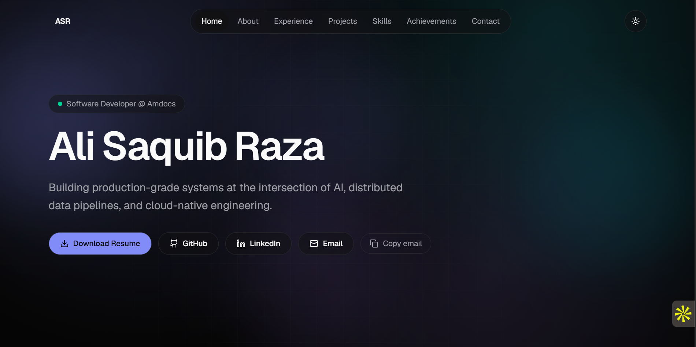

# Ali Saquib Raza — Portfolio

A performance-focused personal portfolio showcasing my work across AI systems, distributed data pipelines, cloud infrastructure, and full-stack development.

[View the live portfolio](https://portfolio-sigma-umber-93.vercel.app)



## About the project

This portfolio presents my professional experience, selected projects, technical skills, certifications, and competitive programming achievements in a responsive, accessible interface. Its content is separated from the UI through typed data files, keeping the codebase easy to maintain and extend.

## Tech stack

- Next.js 15 with the App Router
- TypeScript
- Tailwind CSS
- Framer Motion
- Lucide React
- next-themes
- Vercel

## Highlights

- Mobile-first responsive design
- Dark and light themes
- Animated hero, timeline, project cards, and skill badges
- Active navigation and scroll progress indicator
- Project category filtering
- Resume download and contact shortcuts
- Accessible controls and reduced-motion support
- Open Graph metadata, JSON-LD, sitemap, and robots.txt
- Custom 404 page

## Project structure

```text
app/          Next.js routes, layout, metadata, and SEO files
components/   Layout, section, and reusable UI components
data/         Typed portfolio content
hooks/        Reusable client-side hooks
lib/          Site configuration and utilities
public/       Resume and visual assets
types/        Shared TypeScript interfaces
```

## Development

```bash
npm install
npm run dev
```

Create an optimized production build with:

```bash
npm run build
npm start
```

No environment variables are required. The contact form uses the visitor's configured email client.

## Deployment

The project is deployed on Vercel and is automatically rebuilt when changes are pushed to the production branch.

| Setting | Value |
| --- | --- |
| Framework preset | Next.js |
| Root directory | Repository root |
| Build command | `npm run build` |
| Output directory | Leave blank |
| Install command | `npm install` |

## License

All rights reserved. The source code and portfolio content belong to Ali Saquib Raza.
